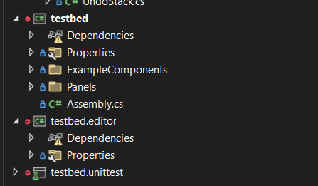

# Editor Project

You can build custom editor tooling for your game in the `Editor` folder. Your game's editor project is special in that it can access both the tools and the game code.

:::warning
Editor projects are not sandboxed. They are not limited by any whitelists and can run any functions. You should be careful when running code you have received from an untrusted source - because it can do almost anything.

:::

# Creating

To create an editor project you create a new component or C# file in the folder named `Editor` at the root of your project. Any code in this folder will be treated as part of the editor project.

You will automatically get an editor project in your IDE called `<projectname>.editor`. There is also an example Editor Utility there.

# Why use the Editor Project

Creating an editor project allows you to build tooling specific to your game and needs. Here are some special things you can do:

* Create [Editor Widgets](/editor/editor-project/editor-widgets.md)
* Create [Editor Tools](/editor/editor-project/editor-tools/index.md)
* Create [Custom Inspectors for your Components or GameResources](/editor/editor-project/custom-editors.md)
* Create new Control Widgets
* Create new Editor Docks
* Create [Editor Apps](/editor/editor-project/editor-apps.md)
* Create [Editor Events](/editor/editor-project/editor-events.md)
* Create [Editor Shortcuts](/editor/editor-project/editor-shortcuts.md)
* Create [Asset Previews](/editor/editor-project/asset-previews.md)
