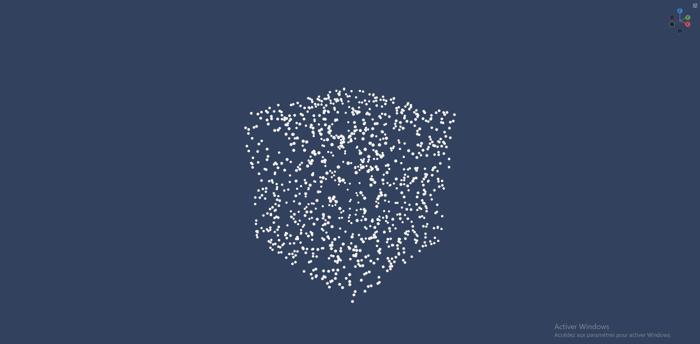
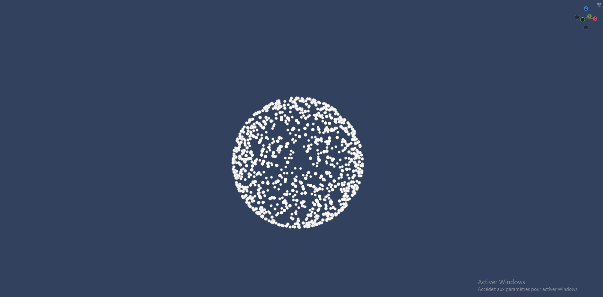
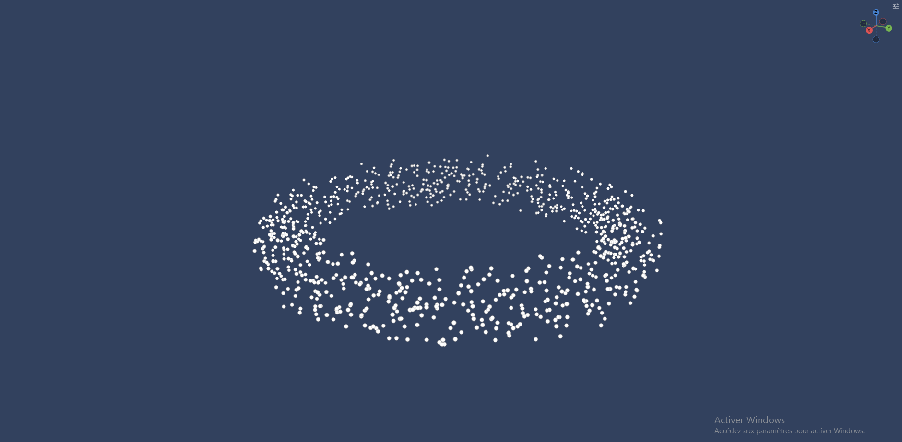
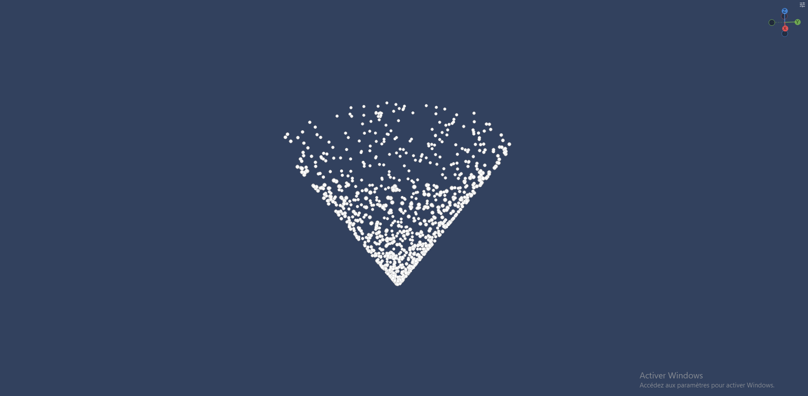
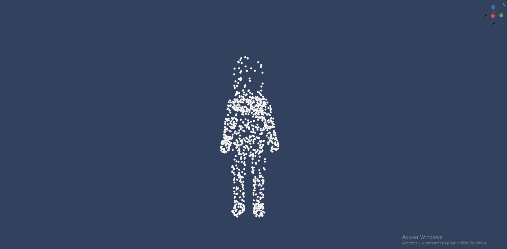
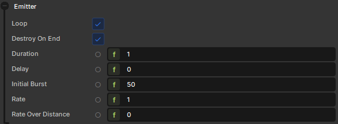

# Emitters

## Shapes

You can have access to different "shapes" of emitters that will decide where your particles will initially spawn. 

The editor has these built-in for you to use:

### Box


### Sphere


### Ring


### Cone


### Model



## Default emitter properties
In all emitters you can find these same parameters. You can randomize all of them and animate the rate and rate over distance with curves over the emitter duration



### Loop
Whether the emitter should restart after finishing

### Destroy on end
Whether the emitter should be destroyed after finishing. Only works if loop is disabled

### Duration
How long the emitter should run for

### Delay
How many seconds before the emitter starts running


### Rate
Will spawn the set amount of particles in a rate per second, so a value of one means 1 particle/sec (any value below 1 is clamped to 0)


### Rate over distance
Will spawn the set amount of particles evenly every 100 units the emitter's GameObject moves


### Burst
Will spawn the set amount of particles at the start of the emitter duration


## Custom emitters
You can create custom emitters by inheriting `ParticleEmitter`

```csharp
using System;

namespace Sandbox;

/// <summary>
/// Emits particles from a triangular shape, lying in the local XY plane.
/// </summary>
public sealed class CustomEmitter : ParticleEmitter
{
	/// <summary>
	/// The size (in units) of the triangle, from its centre to a corner.
	/// </summary>
	[Property, Range( 0, 500 ), Group( "Shape" )] public float Size { get; set; } = 50.0f;

	/// <summary>
	/// If true, particles spawn along the edges of the triangle. Otherwise they fill it.
	/// </summary>
	[Property, Group( "Shape" )] public bool OnEdge { get; set; } = false;

	public override bool Emit( ParticleEffect target )
	{
		// The three corners of an equilateral triangle centred on the origin,
		// pointing up the local +Y axis.
		var a = new Vector3( 0.0f, 1.0f, 0.0f );
		var b = new Vector3( 0.866f, -0.5f, 0.0f );
		var c = new Vector3( -0.866f, -0.5f, 0.0f );

		Vector3 localPos;

		if ( OnEdge )
		{
			// Pick a random edge, then a random point along it.
			var t = Random.Shared.Float( 0, 1 );
			localPos = Random.Shared.Int( 0, 2 ) switch
			{
				0 => Vector3.Lerp( a, b, t ),
				1 => Vector3.Lerp( b, c, t ),
				_ => Vector3.Lerp( c, a, t ),
			};
		}
		else
		{
			// Uniform random point inside the triangle, using barycentric coordinates.
			var r1 = Random.Shared.Float( 0, 1 );
			var r2 = Random.Shared.Float( 0, 1 );
			if ( r1 + r2 > 1.0f )
			{
				r1 = 1.0f - r1;
				r2 = 1.0f - r2;
			}

			localPos = a + r1 * (b - a) + r2 * (c - a);
		}

		var worldPos = WorldTransform.PointToWorld( localPos * Size );

		var p = target.Emit( worldPos, Delta );
		return p is not null;
	}
}

```
With this example component you can have a triangle shape to emit your particles
