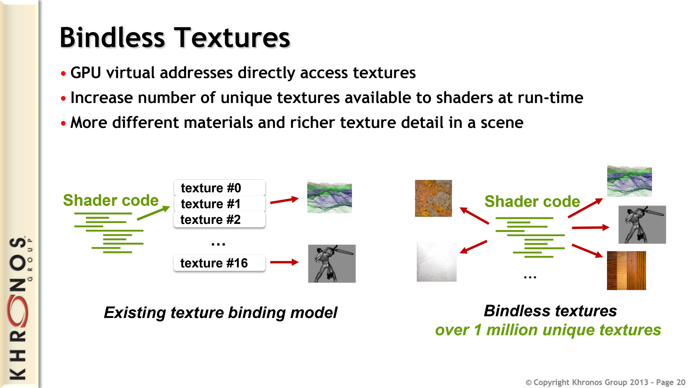
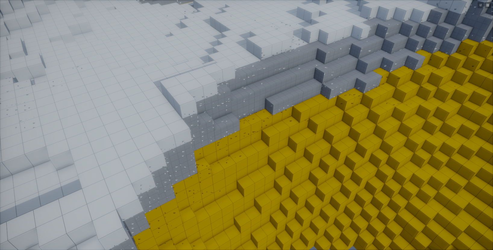

# Bindless API

# What is Bindless

The fancy new way to do things in Vulkan / DX12 is bindless. This removes the limitations of the binding model allowing you to have access to far more textures and other resources within a shader and the ability to sample them from a dynamically provided identifier from buffers, vertex input, etc.

This allows a lot more versatility in your shaders, less CPU time spent binding textures and is the fundamental key to GPU driven rendering.



# Bindless API

## HLSL

The following methods are accessible from shaders:

```cpp
Texture2D Bindless::GetTexture2D( int nIndex, bool srgb = false );
Texture3D Bindless::GetTexture3D( int nIndex );
TextureCube Bindless::GetTextureCube( int nIndex );
Texture2DArray Bindless::GetTexture2DArray( int nIndex );
TextureCubeArray Bindless::GetTextureCubeArray( int nIndex );
SamplerState Bindless::GetSampler( int nIndex );
```

:::tip
sRGB variants of Texture2D can be sampled with Bindless::GetTexture2D( nIndex, true );
:::

Additionally these methods are available in compute shaders only:

```cpp
RWTexture2D<float4> Bindless::GetRWTexture2D( int nIndex );
RWTexture3D<float4> Bindless::GetRWTexture3D( int nIndex );
RWTexture2DArray<float4> Bindless::GetRWTexture2DArray( int nIndex );
```

### Example: Bindless Textures

Here's how you would create a structured buffer in C# containing texture indices and consume them in a shader.

```csharp
struct TerrainMaterial
{
  public int ColorTextureIndex;
  public int NormalTextureIndex;
}

GpuBuffer<TerrainMaterial> TerrainMaterialsBuffer = new( 1 );
TerrainMaterialsBuffer.SetData( new[] {
  new TerrainMaterial {
    ColorTextureIndex = ColorTexture.Index,
    NormalTextureIndex = NormalTexture.Index
  },
  // ...
} );

SceneModel.Attributes.Set( "TerrainMaterials", TerrainMaterialsBuffer );
```

```cpp
struct TerrainMaterial
{
  int ColorTextureIndex;
  int NormalTextureIndex;
};

StructuredBuffer<TerrainMaterial> TerrainMaterials < Attribute( "TerrainMaterials" ); >;

void SampleTerrain( float2 uv, in out float3 color, in out float3 normal )
{
  // Combine 4 dynamic terrain materials together
  for ( int i = 0; i < 4; i++ )
  {
    Texture2D ColorTexture = Bindless::GetTexture2D( TerrainMaterials[i].ColorTextureIndex, true ); // srgb
    Texture2D NormalTexture = Bindless::GetTexture2D( TerrainMaterials[i].NormalTextureIndex );
    
    color += ColorTexture.Sample( Sampler, uv );
    normal += NormalTexture.Sample( Sampler, uv );
  }
}
```

### Example: Bindless Sampler State

You can also create a sampler state from C# and then expose it to shaders via bindless.

```csharp
// Create a new component sampler property with bilinear filtering set as default
[Property] public SamplerState MyBindlessSampler { get; set; } = new() { Filter = FilterMode.Bilinear };

protected override void OnEnabled()
{
  Scene.RenderAttributes.Set( "MyBindlessSamplerIndex", MyBindlessSampler.Index );
}
```

And this is how you read this bindless index value from your shader:

```cpp
// Add an attribute which reads "MyBindlessSamplerIndex" value from C#
int g_nMyBindlessSamplerId < Attribute( "MyBindlessSamplerIndex" ); Default( -1 ); >; 

float4 MainPs( PixelInput i ) : SV_Target0
{
  SamplerState sBindlessSampler = Bindless::GetSampler( g_nMyBindlessSamplerId );
  float3 vColor = g_tColor.Sample( sBindlessSampler, i.vTextureCoords.xy ).rgb;

  return float4( vColor, 1.0f );
}
```

# Non-uniform Resource Index

If your bindless resources index is going to vary across threads within a wave (this could happen if passed from a vertex input) it needs to be marked as non-uniform, otherwise you'll get undefined behavior. In pixel shaders the texture getters already apply `NonUniformResourceIndex` for you; samplers don't (it crashes some AMD drivers), so pass a `NonUniform` index instead:

```cpp
Texture2D texture = Bindless::GetTexture2D( NonUniformResourceIndex( i.TextureIndex ) );

NonUniform samplerIndex = { i.SamplerIndex };
SamplerState sampler = Bindless::GetSampler( samplerIndex );
```


