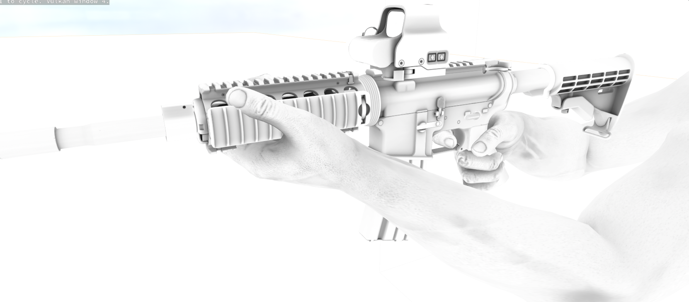
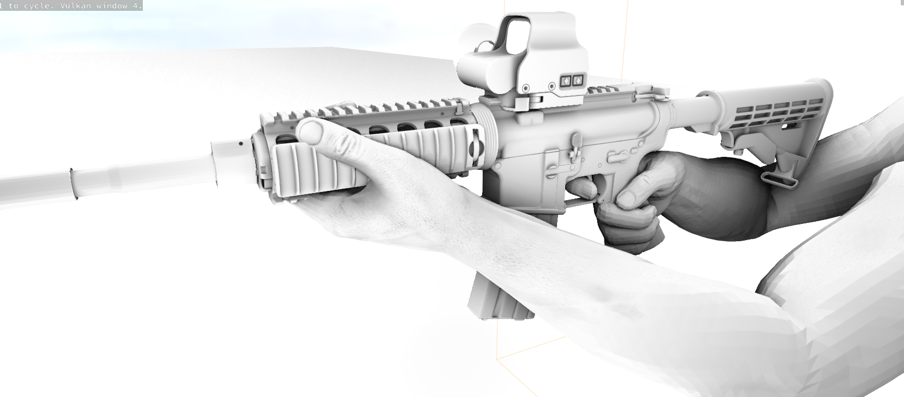

# SSAO

If your custom shader implements custom lighting you can sample the screen space ambient occlusion value for your lighting calculations.

```cpp
float ScreenSpaceAmbientOcclusion::Sample( float4 ScreenPosition )
```

 

Returns `1.0` when no ambient occlusion has been rendered this frame.
