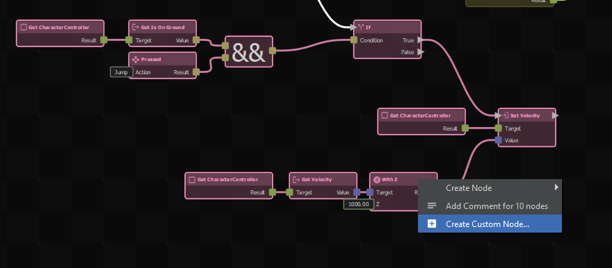
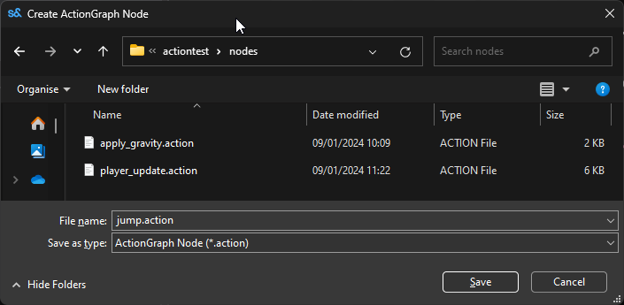

# Action Resources

Action Resources are custom nodes you create visually by grouping existing nodes and saving them as a `.action` file, allowing you to reuse logic across different graphs.

## Quick Start

1. Select a group of nodes in your existing ActionGraph.
2. Right-click and select **Create Custom Node…**
3. Save the new `.action` file.
4. Your selected nodes will be replaced by a single, reusable custom node.

### Converting Existing Logic

Select the nodes you want to convert. The option **Create Custom Node...** won't appear if you include the root node or if the selection has circular dependencies that cannot be extracted cleanly.

### Editing the Custom Node

You can double-click on your newly created custom node in any graph to open its `.action` file in the editor. 
- A **Root node** is automatically created to handle inputs.
- An **Output node** is created to handle any outgoing links from your original selection.

## Configuration

| Action | Result |
|---|---|
| **Right-click nodes -> Create Custom Node...** | Packages the selected nodes into a reusable `.action` asset. |
| **Double-click node** | Opens the `.action` file to edit the internal logic. |

## Troubleshooting

:::danger Cannot Create Custom Node
If the **Create Custom Node...** button is missing when you right-click your selection, it means the nodes cannot be safely isolated. Make sure you haven't selected the main graph's root node, and ensure the data flow into and out of your selection is linear.
:::

## Related Pages
* [C# Method Nodes](c-method-nodes.md)
* [Intro to ActionGraphs](../intro-to-actiongraphs.md)
