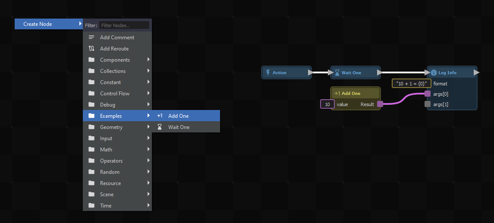

# C# Method Nodes

You can create custom ActionGraph nodes directly in C# by marking static methods with the `[ActionGraphNode]` attribute.

## Quick Start

```csharp
/// <summary>
/// Increments the value by 1.
/// </summary>
[ActionGraphNode( "example.addone" ), Pure]
[Title( "Add One" ), Group( "Examples" ), Icon( "exposure_plus_1" )]
public static int AddOne( int value )
{
	return value + 1;
}

/// <summary>
/// Waits for one second.
/// </summary>
[ActionGraphNode( "example.waitone" )]
[Title( "Wait One" ), Group( "Examples" ), Icon( "hourglass_bottom" )]
public static async Task WaitOne()
{
	await Task.Delay( TimeSpan.FromSeconds( 1d ) );
}
```



### Creating Action Nodes (Impure)

Action nodes (blue nodes with white signal pins) perform an action and modify state. They are created from standard static methods without the `[Pure]` attribute.

```csharp
/// <summary>
/// Waits for one second.
/// </summary>
[ActionGraphNode( "example.waitone" )]
[Title( "Wait One" ), Group( "Examples" ), Icon( "hourglass_bottom" )]
public static async Task WaitOne()
{
	await Task.Delay( TimeSpan.FromSeconds( 1d ) );
}
```

### Creating Expression Nodes (Pure)

Expression nodes (green nodes without signal pins) simply calculate and return a value without changing any state. You define them by adding the `[Pure]` attribute to your static method.

```csharp
/// <summary>
/// Increments the value by 1.
/// </summary>
[ActionGraphNode( "example.addone" ), Pure]
[Title( "Add One" ), Group( "Examples" ), Icon( "exposure_plus_1" )]
public static int AddOne( int value )
{
	return value + 1;
}
```

## Configuration

You can configure how your node appears in the ActionGraph editor using various attributes on your method:

| Attribute | Description |
|---|---|
| `[ActionGraphNode("id")]` | **Required.** Defines the unique ID of the node. |
| `[Pure]` | Marks the node as an expression node (green, no signal pins) that only computes a value. |
| `[Title("Name")]` | Sets the display name of the node in the editor. |
| `[Group("Category")]` | Puts the node in a specific category in the right-click creation menu. |
| `[Icon("icon_name")]` | Sets the Material Design icon for the node. |

## Troubleshooting

:::danger Node Not Appearing in Menu
If your custom node doesn't show up in the ActionGraph right-click menu:
1. Ensure the method is `public static`. Instance methods are not supported as standalone nodes.
2. Check that you used the `[ActionGraphNode]` attribute.
3. Verify there are no C# compilation errors in your project preventing hotload.
:::

:::warning Pure vs Action Node Confusion
If you added `[Pure]` to a method that changes game state (like spawning an entity or modifying a variable), it might not execute when you expect, because pure nodes only evaluate when their outputs are read. Only use `[Pure]` for read-only calculations.
:::

## Related Pages
* [Action Resources](action-resources.md)
* [Intro to ActionGraphs](../intro-to-actiongraphs.md)
