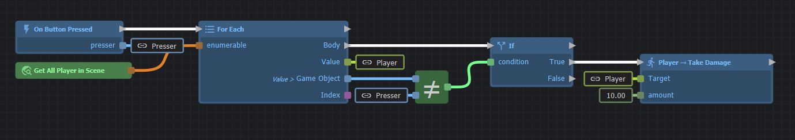
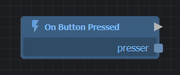
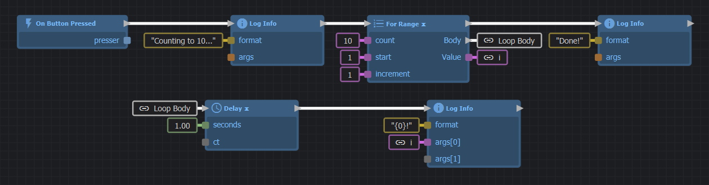

# Intro to ActionGraphs

ActionGraph is a visual scripting system where game logic is represented by connected nodes rather than written code.

## Three ways to create a graph

There's no single "Open ActionGraph" command — you reach the editor through one of three entry points, depending on what you're building:

1. **Built-in Component actions** — drop a `Component Actions` component on any GameObject and pick an event like `OnUpdate` or `OnTriggerEnter`. Quickest path; no C# required. See [Component Actions](component-actions.md).
2. **A new ActionGraph component** — in the Inspector, **Add Component → New ActionGraph Component…**. Lets you author a fully custom component visually with your own properties and methods.
3. **A `Delegate` property in C#** — expose a `Delegate`-typed property on a custom component, and the inspector will offer to edit it as a graph. Use this when you want C# to define the entry point and ActionGraph to fill in the body. See [Using ActionGraph with C#](using-with-c.md).

All three open the same editor.

## Nodes

Nodes appear as rectangles in the ActionGraph editor with a name and sockets on the left (inputs) and right (outputs). You create a node by right-clicking in any empty space, or dragging a link from an output to get a list of compatible nodes.

There are three primary types of nodes:

### 1. Root Nodes

The root node is the entry point of your graph. It is the starting line. It has only output sockets: one white signal socket at the top, and optionally some value sockets if your graph accepts parameters (like the `Other` GameObject when a trigger is entered).

When an event triggers the graph to run, a signal is fired from the root node's white signal socket, traveling down the wire to start the rest of the graph.

### 2. Action Nodes (Blue)

Action nodes are blue and have white, arrow-shaped **Signal Sockets** on their title bar. These nodes actually *do* something that changes the game world (like moving an object, playing a sound, or changing a variable).

They will **only run** if they receive a signal through their left signal socket. Once they finish their action, they fire a signal out of their right signal socket to trigger the next node in the chain.

### 3. Expression Nodes (Green)

Expression nodes are green and **do not** have white signal sockets. They perform calculations (like adding two numbers) or fetch data (like getting the player's current health). Because they don't have signal sockets, you don't explicitly tell them when to run. They evaluate automatically the moment their output value is needed by an Action Node.

## Links (Wires)

Links connect an output of one node to an input of another. 
* A link between white, arrow-shaped sockets carries an **Execution Signal**. This determines the *order* things happen.
* Any other link carries a **Value**. This determines the *data* being used.

Your graph cannot be linked in a way that leads to a cycle (an infinite loop where outputs plug back into their own inputs). Instead, you use special Action Nodes in the *Control Flow* category (like `For Range` or `While`) to perform loops safely.

## Constants

If you don't want to connect a wire to an input, you can use a hard-coded value. When a node is selected, you can directly set its input values in the **Properties** panel on the right side of the screen.

## Troubleshooting

:::danger "My graph isn't doing anything!"
Ensure your Action Nodes are actually connected to the white signal wire chain starting from the Root node. If a node (like a `Set Position` node) doesn't receive a white execution signal, it will never run, even if its value wires are connected perfectly!
:::

## Next Steps

Now you know the basics, the next things to learn are:

* [How to use variables](variables.md) to clean up messy wires.
* [Adding Component Actions](component-actions.md) to start visual scripting immediately.
