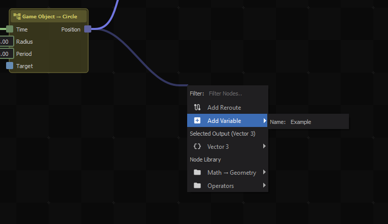
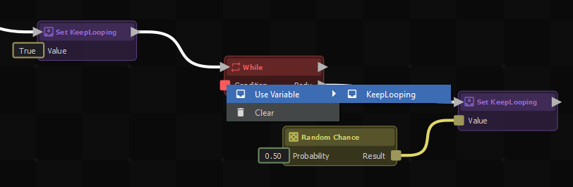

# Manage Variables

Learn how to store, retrieve, and organize data within an ActionGraph to clean up complex wiring.

## Quick Working Example

You can copy and paste this code directly into your ActionGraph editor to see a variable being set and then read.

```none
actiongraph:H4sIAAAAAAAACp2U0UrDQBBFv2Xep02xRRGh1eIT6IukIqJIHySbZhPb7M7sTsFa+u+O6ZZY1JpCeJk7Z865szM3+Z6gnyYIh2pvmRcehwQbV2xchgkIQZAAIzzn50VrJmK3k0vD2KpBOC3leD+2Cj2f5lBCMiPEQk+QY/AFRtwszzwSUEeAASoowhHmAWEoz0IE98YssAaWeXDvxE/22m7v1+kTShJIuV2moHHFlBnlYnT1Jd/5PgH2g+DdvgIh3NU79z/RkEFY2GUw1QFGWgj2zLib3r7fRfekhX02v/QttR2VbKSfmmK/Elit9QX/0b5f1S5wucXyh10Vh1XFuDGD2O3WZqPAti0oSsROlaRUKYyDmAgWxgX91q987R7Vm04J+1myUbtfdT5t22L7UG6IYMLtNYyGbXvrUKIFTEiEcCud4FyNZJV7nccxxXfyhBDntYtqBSRXb0jvEP6oAelVjI/jeUkhE/dapqh1bw6oTMe016BqjD8Eo0XTj2CCtjBBE4zeP6AGQVfUyEd9YQ2KXjcXFN31uQn1oUYnYR3CrYQbUxQQ8qj1dvsF49N2S0YEAAA=
```

### Creating a New Variable

The fastest way to create a variable is from an existing output socket.

1. Drag a link from any output socket (e.g., a float value or a GameObject).
2. Release the mouse in empty space.
3. In the search menu, type and select **Add Variable**.
4. Give your new variable a descriptive name.



This automatically creates a **Set Variable** node that will store the value when the signal reaches it.

### Reading a Variable

Once a variable exists, you can access it anywhere else in your graph.

1. Right-click in empty space to open the node menu.
2. Expand the **Variables** category.
3. Select your variable to create a **Get Variable** node.

Alternatively, you can assign a variable directly to an input socket without creating a separate node. Right-click any input socket on a node, and select your variable from the context menu.



## Configuration

Variables don't have a complex configuration panel. Their type is permanently defined by the output they were created from (e.g., a variable created from a `Vector3` output will always be a `Vector3` variable).

| Property | Description |
|---|---|
| `Name` | The identifier for the variable. You can rename it by clicking the gear icon on any of its Get/Set nodes. |
| `Type` | The data type it holds (implicit, based on creation). |
| `Value` | The current data stored in the variable at runtime. |

## Troubleshooting

:::danger "My variable is returning default/empty values!"
Remember that a **Set Variable** node is an Action Node (it has white signal sockets). The variable will not update unless a white execution signal passes through the Set node. If you only connect the value wire but forget to connect the signal wire, the variable will remain empty.
:::

## Related Pages
- [Intro to ActionGraphs](intro-to-actiongraphs.md)
