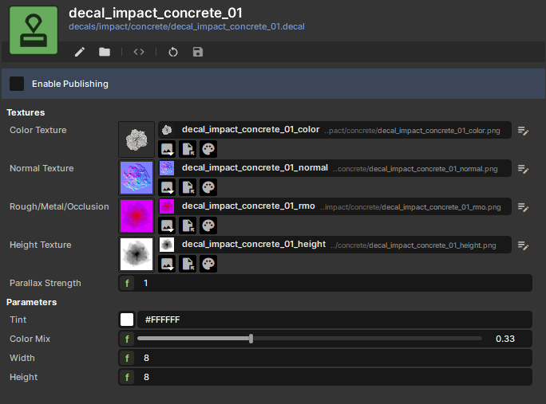

# DecalDefinition

A `DecalDefinition` is the asset (`.decal`) that describes what a single decal looks like. The [`Decal` component](decal-component.md) projects whichever definition you assign — color, normals, roughness/metal/AO, optional emission and parallax. One `Decal` component can hold a list of `DecalDefinition`s and pick one at random per spawn for visual variety.



## Textures

A definition is built from up to five PBR texture maps. Only `ColorTexture` is required — the alpha channel of the colour map is the *mask* that determines the decal's silhouette, so without it nothing else renders.

| Texture | Purpose |
|---|---|
| `ColorTexture` | Albedo + alpha mask. Required; alpha gates everything else. |
| `NormalTexture` | Normal map. Bends surface lighting under the decal. |
| `RoughMetalOcclusionTexture` | Roughness / Metallic / AO packed in RGB channels respectively. |
| `EmissiveTexture` | Emissive contribution. Multiplied by `EmissionEnergy`. |
| `HeightTexture` | Heightmap for parallax. Disabled unless this is set. |

Set `EmissionEnergy` (default `1.0`) to scale the brightness of `EmissiveTexture` — useful when the same emissive map needs to look subtle on one decal and glowing on another.

## Parameters

| Property | Description |
|---|---|
| `Tint` | Tints the albedo. Use it to recolour the same decal asset (red blood vs. green slime). Multiplies `ColorTexture`'s alpha — drop `Tint.a` for cheap fades. |
| `ColorMix` | `0..1`. How strongly the colour texture overrides the surface beneath. `1` = full repaint; `0` = decal contributes only normals/RMO/emissive masked by colour alpha (great for footprints, scratches). |
| `Width` / `Height` | Default world-space size when the `Decal` component spawns this definition. The component's own `Size` overrides at spawn time. |
| `FilterMode` | Texture filtering — `Anisotropic` (default), `Bilinear`, or `Point` (pixel art). |
| `ParallaxStrength` | Multiplier on `HeightTexture` parallax. Hidden in the inspector when no height texture is assigned. |

## Variation pattern

The fastest way to add visual variety is to author **multiple decal definitions** and let the `Decal` component pick one per spawn:

```csharp
[Property] public List<DecalDefinition> BloodSplats { get; set; }

void SpawnBlood( SceneTraceResult hit )
{
    var go = Scene.CreateObject();
    go.WorldPosition = hit.HitPosition;
    go.WorldRotation = Rotation.LookAt( -hit.Normal );

    var decal = go.Components.Create<Decal>();
    decal.Decals = BloodSplats;     // component picks at random
    decal.Transient = true;
}
```

Pair this with the `Rotation` curve on the `Decal` component (set range to `0..360`) so each spawn rotates a different way — a single asset stops looking like a tiled pattern.

## Related

- [Decal Component](decal-component.md) — what consumes the definition.
- [Animated Effects](animated-effects.md) — animating decal properties over time.
- [Lifetime](lifetime.md) — how long the decal exists and how it gets cleaned up.
