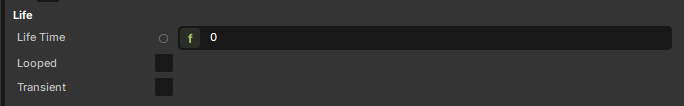

# Lifetime

How long does a decal stick around? It depends on three properties: `LifeTime`, `Looped`, and `Transient`. Their interaction decides whether the decal is a one-shot effect, a perpetual world decoration, or a transient impact that the engine can recycle.



## The four configurations

| `LifeTime` | `Looped` | `Transient` | Behaviour |
|---|---|---|---|
| `> 0` | false | false | One-shot. Stops rendering at the end of `LifeTime`. **The GameObject and component still exist** — pair with [`TemporaryEffect`](../temporaryeffect.md) to actually delete it. |
| `> 0` | true | false | Animated decal that restarts forever. Use for blinking, pulsing, looping VFX. |
| `0` | any | false | Static. Lives forever. The animation curves freeze at their starting value. Right for world graffiti, painted signs. |
| any | any | true | Transient. Subject to the global max-decals cap — the oldest decal gets recycled when a new one would exceed the limit. Right for bullet impacts, blood splats. |

## What "stops rendering" actually means

When `LifeTime` elapses, the decal's render is suppressed. The component, the `GameObject`, and any sibling components remain. If you spawn a thousand decals every minute and don't clean them up, you'll have a thousand inert GameObjects in your scene — slow scene tree, slow saves.

:::info LifeTime stops rendering, not destruction
The decal component will stop rendering at the end of its life, but it won't delete itself or the GameObject. Add a `TemporaryEffect` component if you want the whole hierarchy to clean up. `Decal` implements `Component.ITemporaryEffect`, so `TemporaryEffect` knows to wait for the lifetime to elapse before destroying.
:::

The standard pattern for spawned impacts:

```csharp
var go = Scene.CreateObject();
go.WorldPosition = hit.HitPosition;
go.WorldRotation = Rotation.LookAt( -hit.Normal );

var decal = go.Components.Create<Decal>();
decal.Decals = BulletHoles;
decal.LifeTime = 30f;
decal.Transient = true;                          // recycle if too many
go.Components.Create<TemporaryEffect>();         // and actually delete after lifetime
```

## When to use `Transient`

Mark a decal `Transient = true` when *too many of them* is the expected outcome — bullet holes, footprints, blood. The engine keeps a global running list of transient decals; when the count exceeds the project's max-decals limit, the oldest one is destroyed. You don't have to manage the cap yourself.

Don't use `Transient` for one-off scripted effects (a single graffiti tag, a quest marker). Those should live as long as the lifetime says, no recycling.

## Static (`LifeTime = 0`) is its own thing

`LifeTime = 0` doesn't mean "instant"; it means "forever." The animation curves don't progress because there's no lifetime to evaluate against. Use this for permanent world decals — billboard posters, ground markings, decorative paint splats placed at design time.

If you want a permanent decal whose properties **do** animate (a glowing rune that pulses), set `LifeTime > 0` and `Looped = true`. The lifetime acts as the curve period; the decal restarts on each cycle.

## Related

- [Decal Component](decal-component.md) — the component this all configures.
- [Animated Effects](animated-effects.md) — what `LifeTime` is the period for.
- [Temporary Effect](../temporaryeffect.md) — destroying the GameObject after the decal stops rendering.
