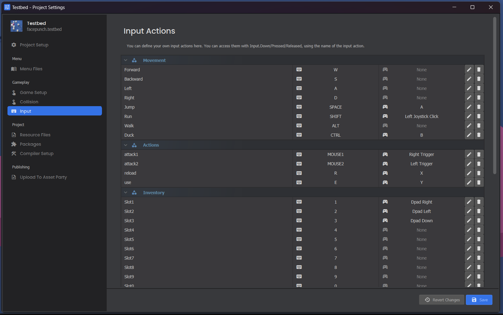

# Input

The Input system provides a unified way to query player actions, buttons, and analog movements across multiple devices.

## Quick Working Example

```csharp
public sealed class MyPlayerComponent : Component
{
	protected override void OnUpdate()
	{
		// Move the GameObject forward when the "jump" action is held down
		if ( Input.Down( "jump" ) )
		{
			WorldPosition += Vector3.Forward * Time.Delta;
		}
	}
}
```

### Querying Button States
You can check the state of any input action using its name. Action names are case-insensitive.

```csharp
Input.Down( "jump" )     // True while the key is held down
Input.Pressed( "jump" )  // True only on the exact frame the key was pressed
Input.Released( "jump" ) // True only on the exact frame the key was released
```

### Analog Input (Movement & Look)
For joysticks, thumbsticks, or mouse movement, use the analog properties.

```csharp
// Returns a Vector3 representing movement (e.g. WASD or left thumbstick)
Vector3 movement = Input.AnalogMove;

// Returns an Angles struct representing look direction (e.g. Mouse or right thumbstick)
Angles look = Input.AnalogLook;
```

### Overriding the Escape Key
By default, s&box shows the pause menu when a player presses the ESC key. You can override this to open your own custom menu instead.

```csharp
protected override void OnUpdate()
{
	if ( Input.EscapePressed )
	{
		Input.EscapePressed = false; // Prevent the default pause menu
		// Open your custom settings menu here
	}
}
```

## Custom Keys

You can customize the available input actions and their default keybinds in **Project Settings → Input** in the Editor.



| Method / Property | Description |
|---|---|
| `Input.Down(action)` | True while the action is held down. |
| `Input.Pressed(action)` | True only on the frame the action was pressed. |
| `Input.Released(action)` | True only on the frame the action was released. |
| `Input.AnalogMove` | Movement input as a `Vector3` (WASD or left thumbstick). |
| `Input.AnalogLook` | Look input as an `Angles` (mouse or right thumbstick). |
| `Input.EscapePressed` | Set to `true` when Escape is pressed. Set to `false` to consume it. |

## Escape Key

By default, s&box shows the pause menu when a player presses ESC. You can intercept and consume it to open your own menu instead.

```csharp
protected override void OnUpdate()
{
	if ( Input.EscapePressed )
	{
		Input.EscapePressed = false; // Prevent the default pause menu
		// Open your custom menu here
	}
}
```

> If you consume the Escape key, it's your responsibility to give the player a way to access settings.

## Troubleshooting

:::warning Unresponsive Inputs
If `Input.Down("my_action")` always returns false, check that the action name exactly matches what's defined in Project Settings. Action names are case-insensitive but must match the defined string.
:::

:::danger Hardcoded Keys
Avoid checking for raw hardware keys (e.g. the "E" key) unless building a typing interface. Always use named actions so your game supports controllers and allows players to remap keys.
:::

## Related Pages

* [Raw Input](raw-input.md)
* [Controller Input](controller-input.md)
* [VR Input](vr-input.md)
* [Input Glyphs](glyphs.md)

## Related Guides

* [**Detect Player Input**](../../how-to/detect-input.md)
