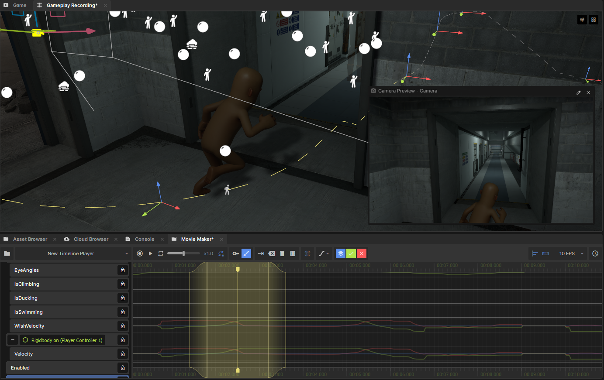

# Movie Maker

Movie Maker is a timeline-based editor to animate properties in a scene. It's ideal for in-game cutscenes, editing trailers, coordinating timed events, and making little animations without leaving the S&box editor.

* 🌱 [Getting Started](getting-started.md)
* 🗺️ [Editor Map](editor-map.md)
* 🔑 [Keyframe Editing](keyframe-editing.md)
* 🖌️ [Motion Editing](motion-editing.md)
* 🦴 [Skeletal Animation](skeletal-animation.md)
* 🎥 [Recording](recording.md)
* 🎞️ [Sequences](sequences.md)
* 📼 [Exporting Video](exporting-video.md)
* 🧑‍💻 [Playback API](playback-api.md)
* 🧑‍💻 [Recording API](recording-api.md)
