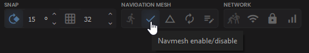
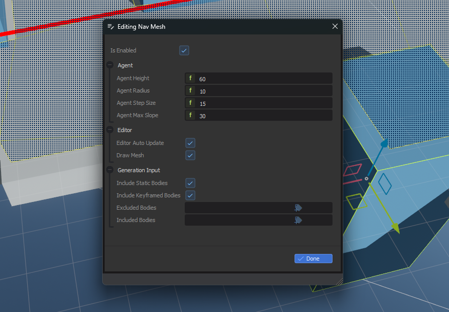

# Navigation

We implement [Recast Navigation](https://github.com/recastnavigation/recastnavigation) in s&box, the industry standard for navmesh generation and navigation agents. It's used in Unreal, Unity and Godot. So if it seems familiar, that's why.


## Quick Working Example

The navmesh is accessible at `Scene.NavMesh`.

```csharp
// Get a random position anywhere the navmesh
var randomPos = Scene.NavMesh.GetRandomPoint();

// Get the closest point on the navmesh from a test position
var closestPos = Scene.NavMesh.GetClosestPoint( testposition );

// Get a path from one position to another
var path = Scene.NavMesh.CalculatePath( new CalculatePathRequest()
{
	Agent = Agent, // Optional agent to use for parameters
    Start = WorldPosition,
    Target = TargetWorldPosition
} );

// Path.Status is either Complete or Partial
if ( path.IsValid() ) 
{
    // Do something with the path...
}
```

## What is a NavMesh?

A NavMesh is a simplified map of traversable areas in a game world, designed to help AI with pathfinding and movement. NavMeshes are created from the game's **PhysicsWorld**, which defines where AI characters are allowed to move.

### Understanding NavMesh Limitations

A NavMesh **is not** a detailed or precise representation of the game world; rather, it is a simplified abstraction focused solely on navigable areas. **It lacks exact height information** or precise ground geometry. Use the PhysicsWorld alongside the NavMesh for interactions that require specific physical details, such as placing the game object on the ground.

## Creating a NavMesh

To create a NavMesh in your scene, just click the **Enable NavMesh** button in the header.



You can toggle viewing the generated mesh by clicking the button next to it.


The NavMesh is split up into multiple smaller tiles. The ==yellow== lines represent regular polygon boundaries, while the ==blue== lines represent polygon borders that are also tile boundaries.

## NavMesh Settings

You can edit further NavMesh settings by clicking the pencil and paper icon in the NavMesh group in the header.



This allows you to adjust the properties of the mesh, like how steep slopes can be. You can also filter which physics objects are used when generating the mesh.

If you ever need to rebuild it manually at runtime from code:

```csharp
// Mark the navmesh dirty, so it will be rebuilt in the background
Scene.NavMesh.SetDirty();
```

## Common Patterns

1. **NavMeshAgents for Movement:** While you can query raw paths using `Scene.NavMesh.CalculatePath()`, it is usually easier to attach a `NavMeshAgent` component to your GameObject. The agent handles the pathfinding and smooth movement towards a target automatically.
2. **Dynamic Obstacles:** Instead of rebuilding the entire NavMesh when a door closes, use a `NavMeshObstacle` component to carve a hole in the existing mesh.
3. **Off-Mesh Links:** For climbing ladders or jumping gaps, use NavMesh Links to connect isolated islands of the NavMesh.

## Troubleshooting

:::warning Common Navigation Gotchas
- **"My AI isn't moving!"**
  Ensure the AI's `NavMeshAgent` is on a valid portion of the NavMesh. You can visualize the NavMesh in the Editor to check for gaps. Also verify the target position is actually reachable.
- **Agents getting stuck on corners:**
  Adjust the Agent Radius in the NavMesh settings. If the radius is too small, agents might try to cut corners too tightly and get snagged on physics colliders.
:::

## Navigation Hub

Explore the Navigation sub-systems to build AI for your games:
* [**NavMesh Agent**](navmesh-agent.md) - Learn how to use the built-in AI agent component that navigates the NavMesh.
* [**NavMesh Areas**](navmesh-areas/index.md) - Define specific zones on the NavMesh with custom traversal rules or blockers.
* [**NavMesh Links**](navmesh-links.md) - Create custom traversal links (like jumps or ladders) to connect separated parts of the NavMesh.

## Related Guides

* [**Build a NavMesh AI**](../../tutorials/build-a-navmesh-ai.md) - A step-by-step tutorial on building a chasing agent.
* [**Create a State Machine AI**](../../how-to/state-machine-ai.md) - A how-to guide on building an AI that transitions between patrolling and chasing.
* [**Create a NavMesh Obstacle**](../../how-to/navmesh-obstacle.md) - A how-to guide on blocking NavMesh paths at runtime.
