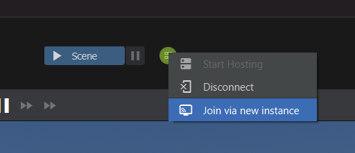

# Testing Multiplayer

The number one best way to test multiplayer is to have someone join your game, but when working locally, you can use built-in tools to spawn multiple instances of your game.

## Quick Working Example

You can open a second instance of the engine and manually join your local editor session by running the following command in the new instance's console:

```text
connect local
```

### Spawning a New Instance via the UI

You can spawn another instance of the game which will automatically join your currently running session.

To do this, click on the network status icon in the header bar, and select `Join via new instance`.



A new instance of the game will appear and join your game.

### Iterating and Live Coding

You can continue to code on your main instance with the game running and the other instance joined. The code changes will be compiled and mirrored to the other client seamlessly. In fact, they will be mirrored to all connected clients, so even if you have a friend joined remotely, their game will update.

## Configuration & Commands

These commands can be used in the developer console to manage local multiplayer testing.

| Command | Description |
|:---|:---|
| `connect local` | Connects the current instance to a locally running host instance on the same machine. |
| `reconnect` | Disconnects and reconnects to the last known server. |
| `disconnect` | Disconnects the current instance from the server. |

## Troubleshooting

:::warning Connection Refused
If `connect local` fails, ensure your primary instance actually has the game running and acting as a host. If you are just sitting in the editor without pressing 'Play', there is no server to connect to.
:::

## Related Pages

* [Networking & Multiplayer](index.md)
* [Dedicated Servers](dedicated-servers/index.md)
