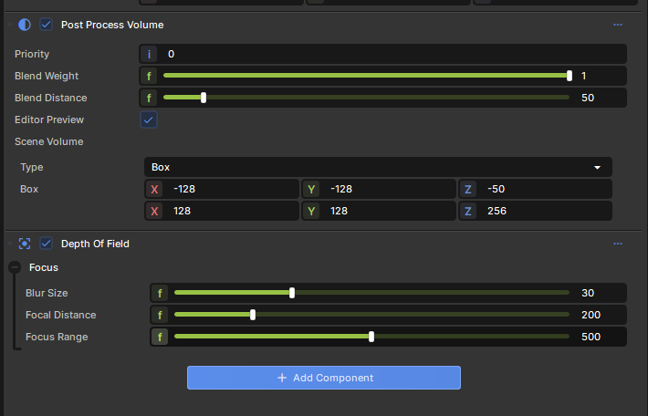

# PostProcessVolume

The `PostProcessVolume` component applies a specific set of post-processing effects only when a camera enters its boundaries.



## Quick Working Example

```csharp
using Sandbox;
using Sandbox.Volumes;

public class ToxicGasZone : Component
{
	protected override void OnStart()
	{
		// Create a PostProcessVolume on this object
		var volume = Components.GetOrCreate<PostProcessVolume>();
		
		// Configure the volume shape using SceneVolume
		volume.SceneVolume = new SceneVolume 
		{
			Type = SceneVolume.VolumeTypes.Box,
			Box = BBox.FromPositionAndSize( 0, 500 )
		};
		
		// Add an effect to the volume (e.g. Color Grading)
		var grading = Components.GetOrCreate<ColorGrading>();
		grading.ColorFilter = Color.Green;
		
		// Set a blend distance for a smooth transition as the player walks in
		volume.BlendDistance = 100f;
	}
}
```

### Soft Transitions (Blending)

You rarely want an effect to snap on instantly when crossing a boundary. By setting the `BlendDistance`, the effects will smoothly fade in as the camera moves deeper into the volume.

```csharp
var volume = Components.Get<PostProcessVolume>();

// Effects will start blending in when the camera is 200 units away from the edge
volume.BlendDistance = 200f;
```

### Infinite Volumes

An infinite volume has no physical boundaries. It applies its effects universally, but its `BlendWeight` can be animated programmatically. This is useful for global screen effects like taking damage or dying.

```csharp
public class DeathEffect : Component
{
    [Property] public PostProcessVolume DeathVolume { get; set; }
    
    public void OnPlayerDie()
    {
        // Smoothly fade up the infinite death volume effect over time
        // (Assuming you have a script driving this blend weight)
        DeathVolume.BlendWeight = 1.0f;
    }
}
```

### Overlapping Volumes

If two volumes overlap, the engine blends them based on their `Priority`. The volume with the higher priority number overrides the lower priority one.

## Configuration

| Property | Description |
|---|---|
| `Priority` | Higher priority volumes override lower priority ones. The default is 0. |
| `BlendWeight` | A master multiplier (0.0 to 1.0) for the intensity of the effects. Useful for fading infinite volumes via code. |
| `BlendDistance` | Distance from the edge of the volume where blending starts. 0 means a hard edge, higher values create softer transitions. *(Hidden if IsInfinite is true).* |
| `EditorPreview` | If true, the editor viewport will preview the post-processing effects when this object is selected or when the editor camera is inside the volume. |

## Troubleshooting

:::danger "The volume isn't applying any effects!"
1. Check that the `PostProcessVolume` has its `SceneVolume` properly configured. Ensure the `Type` is set correctly (e.g., Box, Sphere, Capsule) and that the bounds cover your desired area. Without proper bounds, the volume will not trigger (unless it is an infinite volume).
2. Ensure the `CameraComponent` rendering the view has **Enable Post Processing** checked.
3. Verify that the effect components (like `Bloom` or `ColorGrading`) are on the same GameObject as the `PostProcessVolume` or on one of its children.
:::

:::warning "Effects snap on instantly without blending"
Make sure your `BlendDistance` is greater than 0. If it is 0, the effects will activate instantaneously exactly at the volume's boundary.
:::

## Related Pages
- [Post Processing Index](index.md)
- [Camera Component](../../scene/components/reference/cameracomponent.md)