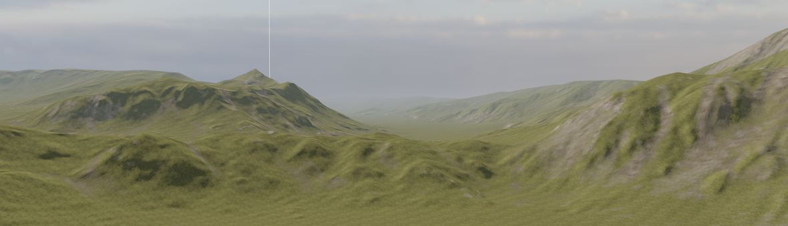

# Terrain

The Terrain System allows you to create expansive outdoor environments quickly and easily in your scenes.



## Quick Working Example

```csharp
public class TerrainGenerator : Component
{
	protected override void OnStart()
	{
		// Add a Terrain component to this GameObject
		var terrain = Components.GetOrCreate<Terrain>();
		
		// Note: The Terrain needs a Storage asset to render and provide collision
		// You typically assign this in the editor, but you can assign it in code:
		// terrain.Storage = ResourceLibrary.Get<TerrainStorage>("path/to/my_terrain.terrain");

		// You can toggle collision programmatically
		terrain.EnableCollision = true;
	}
}
```

## Troubleshooting

:::warning Objects falling through terrain
If physics objects fall through your Terrain:
1. Ensure the `Terrain` component's **EnableCollision** property is ticked (it is true by default).
2. The `Terrain` component must have a **Storage** asset assigned. A Terrain without a Storage asset has no physical shape, preventing collision meshes from being generated.
3. Check the internal size scaling: your heightmap's resolution must be positive, and must not result in an `OverflowException` when squared.
:::

## Navigation Hub

- [**Creating Terrain**](creating-terrain.md): How to create, size, and set up the heightmap for a new landscape.
- [**Terrain Materials**](terrain-materials.md): How to paint the landscape with PBR textures and apply physical surfaces.

The Terrain System is a work in progress, here's what is supported and what's not right now.

| Feature Name | Supported | Not Supported | Notes |
|--------------|-----------|---------------|-------|
| Real-time editing | ✅         |               | Basic sculpting tools & 2 layer texture painting |
| Import Heightmaps | ✅         |               | Import from World Machine, GeoGen, Gaia. Anything that can export a 16 bit heightmap. |
| Level of Detail | ✅         |               | Very large landscapes possible |
| Multi-Layer PBR Materials | ✅         |               | Support up to 32 materials.<br>Can import multiple splatmaps. |
| Material Height Blending | ✅         |               |       |
| Material Anti-Tiling | ✅         |               |       |
| Physics Materials | ✅         |               | Physics properties are applied per material used: footstep sounds, bounciness, etc. |
| Foliage      | ✅         |               | Grass & scatter meshes |
| Trees        | ✅         |               |       |
| Holes        | ✅         |               |       |
| Nav Mesh     | ✅         |               |       |
| Displacement | ✅         |               | Vertex displacement |
