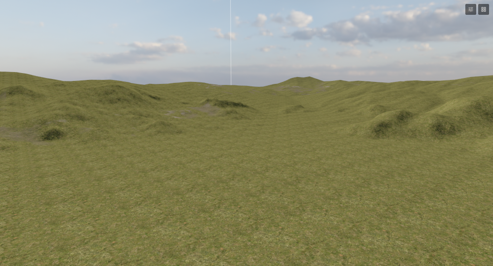
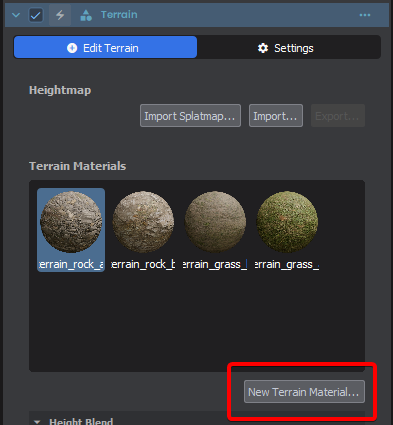
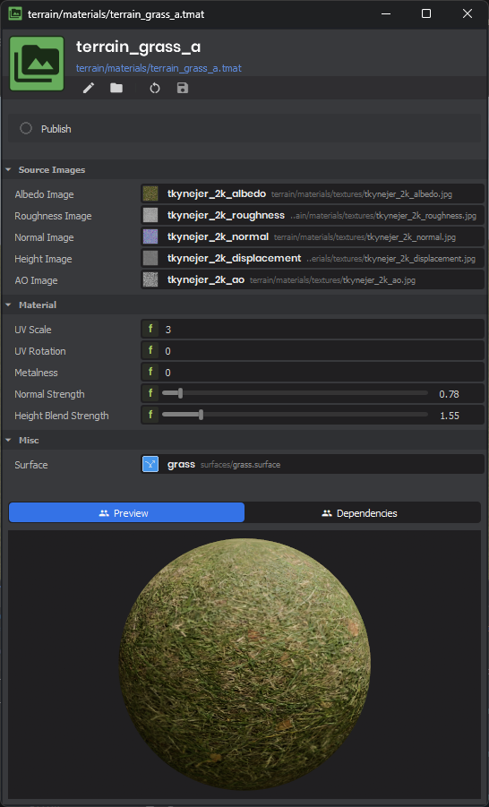
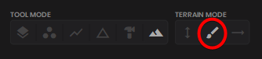
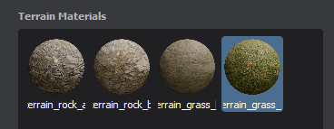

# Terrain Materials

A **Terrain Material** is an Asset that defines a set of PBR textures, physics surfaces, detail meshes and other properties that the Terrain uses to render.

Because they are Assets you can easily reuse them on multiple Terrains in different Scenes easily, transfer them between projects, or use them from the cloud.

These are similar but different to standard Materials because Terrain uses specialized shaders for rendering to deliver performant landscape rendering with LOD support and material blending.

:::tip
Physics properties like footstep sounds, friction, and bounciness are automatically applied based on the Terrain Material used in a given area.
:::

The first Terrain Material you apply to a Terrain automatically becomes the base layer, and spreads over the whole landscape. You can then paint areas with other Terrain Materials blending them together.

## Creating Terrain Materials

To create a new Terrain Material, select your Terrain GameObject and look at the Inspector, under Terrain Materials press `New Terrain Material…` Pick a save location and it will be automatically added to your Terrain Material list.

A resource editor window will open allowing you to select and modify the properties of the Terrain Material.

You can also create a Terrain Material that isn't automatically associated with a Terrain, by rick-clicking the Asset Browser and selecting **New Asset → New Terrain Material…**

## Adding Terrain Materials

Existing Terrain Material assets can be dragged from the Asset Browser into the Terrain Material list - or onto the Terrain itself.

Terrain Materials can be found on the cloud by clicking the Browse… button, or filtering `@cloud ext:tmat`.

:::warning
There is a limit of 4 Terrain Materials currently, this is planned to be resolved.
:::

## Terrain Material Properties

The Terrain Material asset exposes several properties to configure how the material looks and behaves on the terrain.

### Source Images

These properties define the raw textures that will be compiled into the final rendering textures used by the Terrain system.

| Property | Description |
|---|---|
| **Albedo Image** | The base color texture of the material (e.g. grass, dirt, rock). |
| **Roughness Image** | Defines how rough or smooth the material surface is, affecting reflections. |
| **Normal Image** | Provides surface details and bumps without adding polygons. |
| **Height Image** | Used for height-based blending between different materials and for vertex displacement. |
| **AO Image** | Ambient Occlusion texture, adding soft shadows in crevices. |

### Material Settings

These settings control the visual appearance and blending behavior of the terrain material.

| Property | Description |
|---|---|
| **UV Scale** | How many times the texture repeats across the terrain. Higher values mean the texture tiles more frequently. |
| **Metalness** | How metallic the surface appears (0.0 to 1.0). Usually 0.0 for natural terrain materials. |
| **Normal Strength** | Multiplier for the Normal Image effect (0.1 to 10). Higher values make bumps more pronounced. |
| **Height Blend Strength** | Multiplier used when blending this material with others based on their Height Images (0.1 to 10). |
| **Displacement Scale** | Controls the physical vertex displacement of the terrain geometry based on the Height Image. *(Only visible if a Height Image is assigned)*. |
| **No Tiling** | When checked, applies anti-tiling algorithms to break up visible repeating patterns over large areas. |

### Physics and Interaction

| Property | Description |
|---|---|
| **Surface** | The Physics Surface applied to this material. This determines footstep sounds, friction, bounciness, and impact effects. |

## Painting Terrain Materials

The first material is applied across the entire Terrain by default. You can paint subsequent Terrain Materials using the Paint Texture tool and selecting the Terrain Material in the list in the inspector.

